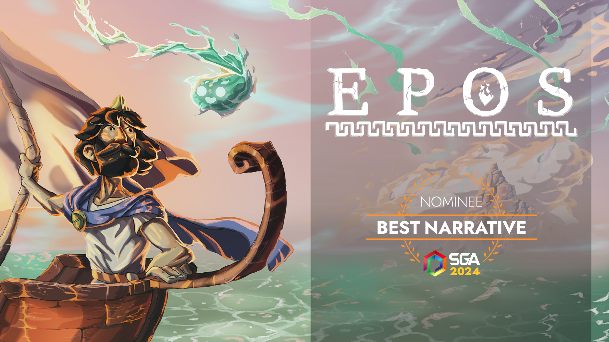
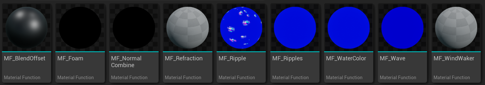

```
Developed:  2024 April - 2024 June
Duration:   8 Weeks
Engine:     Unreal Engine
Genre:      Casual Story Adventure
Team:       4 Programmers, 4 Artists
```
## A Brief Game Description  <br>

Embark on a harrowing journey across uncharted seas as Odysseus with the aid of Circe and unravel the fate of your fallen crew in a haunting quest for redemption.
<br>


For more info: [itch.io](https://yrgo-game-creator.itch.io/epos) <br>
Watch the official trailer here: [Trailer](https://www.youtube.com/watch?v=XEvlUR7UJDQ)

## Contributions 

My main contribution to Epos was designing the water system. I dedicated considerable time to researching the best approach to ensure it matched our project’s goals and reflected our team's artistic vision. After 2 week of exploring and trying different methods, we decided that our own water shader would yield the best results. This led to a highly customizable, stylized shader that was both attractive, environmental interactive and easy to use, allowing our artists to adjust settings to achieve their desired look.

Although I had no prior experience with shader programming, I embraced the challenge to support our artists, many eager to engage more deeply with the engine but hesitant about its technical aspects. By creating a flexible and user-friendly water shader, I allowed them to experiment confidently within the engine without the risk of breaking anything.

However, I also worked on other areas of the game, contributing to different systems to support the overall gameplay experience.

#### Below, I’d like to highlight the specific features that I implemented:

- [Key Features and Design](#key-features-and-design)
- [Shader Customization](#shader-customization)
- [Vertex Painting](#vertex-painting)

## Key Features and Design
| |
|:---|
| I initiated the project by developing several core material functions within Unreal Engine, which I then abstracted and combined to create the main water material. These functions make the shader super flexible and easy to adapt to all sorts of environments and styles. Here are some of the key features:<br><br>- **Blend Offset**: For smooth transitions between different water effects.<br>- **Foam**: To create customizable foam patterns.<br>- **Normal Combination**: For detailed surface textures.<br>- **Refraction**: To simulate light bending through the water.<br>- **Water Color**: To adjust the color of the water based on depth and lighting conditions.<br>- **Wind Waker "Caustics"**: Inspired by The Legend of Zelda: The Wind Waker, this function simulates stylized caustic lighting effects that can be used with Vertex painting .<br><br>Click the link below to see the `Main Material Graph!` <br>[View Material Details](https://raw.githubusercontent.com/kamudo0102/Game-Programming-Portfolio/refs/heads/main/Images/MaterialGraph-PreviewMaterial_0_0.png) |


## Shader Customization

| <div style="text-align: left;"> The water shader I developed in Unreal Engine is designed to be highly customizable and artist-friendly, you can tweak a ton of visual settings right in the Details panel.<br><br> Within the Details panel, each of the customizable features is exposed with sliders, values, and toggle options.<br><br> By giving game artists access to these customizable parameters, the shader allows for fast iteration and adjustment, without needing to alter complex material nodes. <br><br> Click the link below to see the `Material Details!` <br> [View Material Details](https://raw.githubusercontent.com/kamudo0102/Game-Programming-Portfolio/refs/heads/main/Images/Details-MaterialEditorInstanceConstant_2.png)</div> |  |
|:---|---|


## Vertex Painting

| <div style="text-align: left;"> As per the game artists' request, I developed layers featuring two distinct stylized caustics that can be applied using vertex painting. Additionally, I incorporated several adjustable parameters. You can modify the caustic's size, alter the noise intensity, adjust the movement noise scale, and fine-tune the blending effects. Furthermore, this process resulted in a third layer that maintains the same parameters, but instead of caustics, it presents a lighter water color that creates the illusion of a sandbed beneath the islands. |  |
|:---|---|

 


