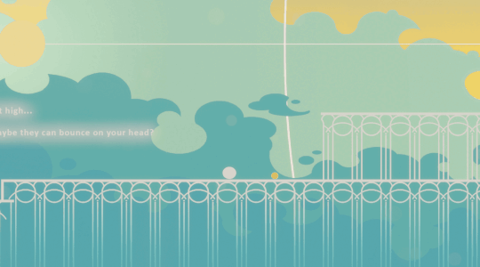

```
Developed:  2023 December - 2024 January
Duration:   7 Weeks
Engine:     Unity
Genre:      2D Casual Platformer
Team:       3 Programmers, 3 Artists
```
# A Brief Game Description
**PARENTHOOD** explores the need to protect what is innocent and vulnerable. It tells you the story of love and growth, without a single word spoken.
Play as a parent whose only objective is to protect its child, which in lack of better understanding enters dangerous situations. 

Embark on a journey together, and experience the story of familial love and the act of growing up. 

Prepare for the hardships life throws at you and the undeniable beauty that comes with it.

For more info: [itch.io](https://yrgo-game-creator.itch.io/parenthood) <br>
Watch the official trailer here: [Trailer](https://youtu.be/uss46DK8tEI)

## Contributions
My primary contribution to the game involved developing the character controller for the 'Mother' character and designing various platforms, each with unique behaviors.

However, I also worked on other areas of the game, contributing to different systems to support the overall gameplay experience.

## Player Movement

||
|---|

MotherMovement.cs features:

- **Horizontal Movement**: Implements smooth movement with acceleration.
- **Jump Mechanics**: Includes coyote time and jump buffering.
- **Platform Interactions**: Supports moving and conveyor platforms.
- **Wall Detection**: Detects walls for potential interactions.
- **Animation Handling**: Manages character animations.
- **God Mode**: Provides a toggleable mode for physics-free movement.

> *To improve readability and maintainability, the script is organized into regions.*

<br>

<details>
<summary><strong>Show MotherMovement.cs</strong></summary>
	
```cs
public class MotherMovement : MonoBehaviour
{
    #region Jump Settings
    [Header("Jump Settings")]
    [SerializeField] private float jumpPower = 12f;
    [SerializeField] private float coyoteTimeDuration = 0.1f;
    [SerializeField] private float jumpBufferTime = 0.2f;
    private float coyoteTimeCounter;
    private float jumpBufferCounter;
    #endregion

    #region Ground Checking
    [Header("Ground Checking")]
    [SerializeField] private Transform groundCheck;
    [SerializeField] private LayerMask groundLayer;
    [SerializeField] private LayerMask jumpStepLayer;
    [SerializeField] private float groundCheckDistance = 0.2f;
    [SerializeField] private Vector2 groundCheckBoxSize = new Vector2(0.5f, 0.1f);
    private bool hasLanded = true;
    #endregion

    #region Wall Checking
    [Header("Wall Checking")]
    [SerializeField] private float wallCheckThreshold = 1.0f;
    private float wallCheckTimer;
    public bool isTouchingWall = false;
    #endregion

    #region Movement Settings
    [Header("Movement Settings")]
    [SerializeField] private float movementAcceleration = 20f;
    [SerializeField] private float maxMoveSpeed = 7f;
    private float horizontalInput;
    private bool isFacingRight = true;
    private float lockedDirection;

    [HideInInspector] public GameObject platform;
    public bool onConveyor;
    public bool onMovingPlatform;

    private Rigidbody2D rb;
    #endregion

    #region Animation
    private Animator motherAnimator;
    #endregion

    #region God Mode
    public bool isGodMode = false;
    #endregion

    #region Direction and Events
    public enum Directions { None, Left, Right };
    public Directions currentDirection = Directions.None;
    public UnityEvent onLanding;
    public UnityEvent onJumping;
    #endregion

    #region Unity Methods
    private void Start()
    {
        motherAnimator = GetComponentInChildren<Animator>();
        rb = GetComponent<Rigidbody2D>();
    }

    private void Update()
    {
        HandleInput();
        HandleJump();
        FlipCharacter();
        WallCheck();
    }

    private void FixedUpdate()
    {
        if (isGodMode)
        {
            HandleGodModeMovement();
            return;
        }

        if (platform != null && platform.transform.parent != null)
        {
            rb.velocity += platform.GetComponent<Rigidbody2D>().velocity;
        }

        if (!onConveyor)
        {
            HandleMovement();
        }
        else
        {
            MoveOnConveyor();
        }
    }

    private void OnDrawGizmos()
    {
        Gizmos.color = Color.red;
        Gizmos.DrawWireCube(transform.position - Vector3.up * groundCheckDistance, groundCheckBoxSize);
    }
    #endregion

    #region Input Handling
    private void HandleInput()
    {
        horizontalInput = 0;
        if (Input.GetKey(KeyCode.A) || Input.GetKey(KeyCode.LeftArrow))
        {
            SetDirection(Directions.Left);
            horizontalInput = -1;
        }
        if (Input.GetKey(KeyCode.D) || Input.GetKey(KeyCode.RightArrow))
        {
            SetDirection(Directions.Right);
            horizontalInput = 1;
        }
        if (Input.GetKeyUp(KeyCode.A) || Input.GetKeyUp(KeyCode.LeftArrow) ||
            Input.GetKeyUp(KeyCode.D) || Input.GetKeyUp(KeyCode.RightArrow))
        {
            lockedDirection = 0;
        }
    }

    private void SetDirection(Directions newdDirection)
    {
        if (currentDirection != newdDirection && lockedDirection == 0)
        {
            lockedDirection = newdDirection == Directions.Left ? -1 : 1;
        }
        currentDirection = newdDirection;
    }
    #endregion

    #region Movement
    private void HandleMovement()
    {
        if (lockedDirection != 0)
        {
            horizontalInput = lockedDirection;
        }

        float targetSpeed = horizontalInput * maxMoveSpeed;
        if (onMovingPlatform)
        {
            rb.velocity = new Vector2(horizontalInput * 3f, rb.velocity.y);
        }
        else
        {
            rb.velocity = new Vector2(Mathf.MoveTowards(rb.velocity.x, targetSpeed, movementAcceleration * Time.fixedDeltaTime), rb.velocity.y);
        }

        UpdateWalkingAnimation();
    }

    private void MoveOnConveyor()
    {
        Vector2 conveyorMovement = new Vector2(horizontalInput, 0f);
        transform.Translate(conveyorMovement * maxMoveSpeed * Time.deltaTime);
    }

    private void UpdateWalkingAnimation()
    {
        bool isWalking = Mathf.Abs(horizontalInput) > 0.1f;
        motherAnimator.SetBool("isWalking", isWalking);
    }
    #endregion

    #region Jump Handling
    private void HandleJump()
    {
        if (jumpBufferCounter > 0f && coyoteTimeCounter > 0f)
        {
            Jump();
        }

        if (Input.GetButtonUp("Jump") && rb.velocity.y > 0f)
        {
            rb.velocity = new Vector2(rb.velocity.x, rb.velocity.y * 0.5f);
            coyoteTimeCounter = 0f;
        }

        UpdateJumpBuffer();
        UpdateCoyoteTime();
    }

    private void Jump()
    {
        rb.velocity = new Vector2(rb.velocity.x, jumpPower);
        jumpBufferCounter = 0f;
        onJumping?.Invoke();
    }

    private void UpdateJumpBuffer()
    {
        if (Input.GetButtonDown("Jump"))
        {
            jumpBufferCounter = jumpBufferTime;
        }
        else
        {
            jumpBufferCounter -= Time.deltaTime;
        }
    }

    private void UpdateCoyoteTime()
    {
        if (IsGrounded())
        {
            coyoteTimeCounter = coyoteTimeDuration;
        }
        else
        {
            coyoteTimeCounter -= Time.deltaTime;
        }
    }

    private bool IsGrounded()
    {
        bool isGrounded = Physics2D.BoxCast(transform.position, groundCheckBoxSize, 0, Vector2.down, groundCheckDistance, groundLayer);
        if (isGrounded && hasLanded)
        {
            hasLanded = false;
            onLanding?.Invoke();
        }
        else if (!isGrounded)
        {
            hasLanded = true;
        }
        return isGrounded;
    }
    #endregion

    #region Character Control
    private void FlipCharacter()
    {
        if (isFacingRight && horizontalInput < 0f || !isFacingRight && horizontalInput > 0f)
        {
            isFacingRight = !isFacingRight;
            Vector3 scale = transform.localScale;
            scale.x *= -1f;
            transform.localScale = scale;
        }
    }

    private void WallCheck()
    {
        bool rightWall = Physics2D.BoxCast(transform.position, new Vector2(0.11f, 0.15f), 0, Vector2.right, 0.2f, jumpStepLayer);
        bool leftWall = Physics2D.BoxCast(transform.position, new Vector2(0.11f, 0.15f), 0, Vector2.left, 0.2f, jumpStepLayer);

        if (rightWall || leftWall)
        {
            wallCheckTimer += Time.deltaTime;
            if (wallCheckTimer >= wallCheckThreshold)
            {
                isTouchingWall = true;
            }
        }
        else
        {
            isTouchingWall = false;
            wallCheckTimer = 0f;
        }
    }
    #endregion

    #region God Mode
    public void EnableGodMode()
    {
        GetComponent<Collider2D>().enabled = false;
        rb.gravityScale = 0;
        isGodMode = true;
    }

    public void DisableGodMode()
    {
        GetComponent<Collider2D>().enabled = true;
        rb.gravityScale = 1f;
        isGodMode = false;
    }

    private void HandleGodModeMovement()
    {
        float moveSpeed = 10f;
        float horizontal = Input.GetAxis("Horizontal");
        float vertical = Input.GetAxis("Vertical");

        Vector3 moveDirection = new Vector3(horizontal, vertical, 0f);
        transform.Translate(moveDirection * moveSpeed * Time.deltaTime);
        rb.gravityScale = 0f;
    }
    #endregion
}
```

</details>


## Platforms

#### Short Info
The development of platform systems went through several stages. The first version was the Rising Platform, which handled basic vertical movement. As the project progressed, I was assigned to work on more advanced platforms and developed a better system.

The key difference between the scripts is that VerticalMovementPlatform.cs only supports simple vertical movement. In contrast, MovingPlatform.cs allow for flexible, multi-point movement with the help of DOTween features like loops, easing types, and path systems. This makes MovingPlatform.cs much more versatile, as it can handle more movement patterns and the DOTween setup adds flexibility when tweaking platform behaviors.


<br>


### Platform MK1 - Rising

||
|---|


The `VerticalMovementPlatform.cs` controls the movement of a platform in a vertical direction. It uses a coroutine to transition the platform between its starting position and a specified end position over a set duration using Lerp. 

> *Click the dropdown arrow below to see `code`!* <br>

 <details>
  <summary><strong>VerticalMovementPlatform.cs</strong></summary>
    
```cs
public class VerticalMovementPlatform : MonoBehaviour
{
    public float endYPosition;         
    public float moveDuration = 2f;     
    private float startYPosition;
    private bool isMoving = false;

    private void OnTriggerEnter2D(Collider2D other)
    {
        if (other.CompareTag("Player") && !isMoving)
        {
            StartCoroutine(MovePlatform());
        }
    }

    private IEnumerator MovePlatform()
    {
        isMoving = true;
        startYPosition = transform.position.y;
        float timeElapsed = 0f;

        while (timeElapsed < moveDuration)
        {
            float t = timeElapsed / moveDuration;
            t = t * t * (3f - 2f * t);
            float newYPosition = Mathf.Lerp(startYPosition, endYPosition, t);
            transform.position = new Vector2(transform.position.x, newYPosition);
            timeElapsed += Time.deltaTime;
            yield return null;
        }
        transform.position = new Vector2(transform.position.x, endYPosition);
        isMoving = false;
    }
}

```
  </details>

### Platform MK2 - Floating


|  |  |
|:---:|:---:|
|  | |

The `MovingPlatform.cs` script controls platform movement along a set path using the DOTween library. It moves between different points and smoothly transitions back and forth over a set period, allowing for customizable looping and easing options.

> *Click the dropdown arrow below to see `code`!* <br>

 <details>
  <summary><strong>MovingPlatform.cs</strong></summary>
    
```cs
public class MovingPlatform : MonoBehaviour
{
    [Header("Platform Configuration")]
    public Transform[] coordinatesTransform = new Transform[2];
    public MotherMovement motherMovement;
    public PathType pathSystem = PathType.CatmullRom;

    [Header("Platform Movement Settings")]
    public float waitDuration;
    public float duration = 1f;
    public float percentageDistance;
    [Range(0, 1)] public float startPercentageDistance;

    void Start()
    {
        Vector3[] coordinates = new Vector3[coordinatesTransform.Length];

        for (int i = 0; i < coordinatesTransform.Length; i++)
        {
            coordinates[i] = coordinatesTransform[i].position;
        }

        var path = transform.DOPath(coordinates, duration, pathSystem);
        path.SetLoops(-1, LoopType.Yoyo);
        path.SetEase(Ease.InOutQuint);
        path.SetUpdate(UpdateType.Fixed, true);
    }

    private void OnTriggerEnter2D(Collider2D other)
    {
        if (other.gameObject.CompareTag("Player") || other.gameObject.CompareTag("child"))
        {
            motherMovement.onMovingPlatform = true;

            var parentHandler = other.transform.parent.GetComponent<ParentHandler>();
            if (parentHandler != null)
            {
                parentHandler.SetParent(transform);
            }
        }
    }

    private void OnTriggerExit2D(Collider2D other)
    {
        if (other.gameObject.CompareTag("Player") || other.gameObject.CompareTag("child"))
        {
            motherMovement.onMovingPlatform = false;

            var playerHandler = other.transform.parent.GetComponent<ParentHandler>();
            if (playerHandler != null)
            {
                playerHandler.SetParent(null);
            }
        }
    }
}


```
  </details>

## Conveyor Belt

||
|:---:|:---:|

The conveyor belt uses a Surface Effector 2D and Polygon Collider 2D to move objects with a Rigidbody2D, simulating conveyor belt behavior. When a player with <strong>MotherMovement.cs</strong> steps on it, their movement adjusts to match the conveyor's speed and direction.

> *Click the dropdown arrow below to see `code`!* <br>

 <details>
  <summary><strong>MotherMovementStopper.cs</strong></summary>
    
```cs
public class MotherMovementStopper : MonoBehaviour
{
    private void OnCollisionEnter2D(Collision2D collision)
    {
        if (collision.gameObject.CompareTag("Player"))
        {
            MotherMovement motherMovement = collision.gameObject.GetComponent<MotherMovement>();
            motherMovement.onConveyer = true;
        }
    }
    private void OnCollisionExit2D(Collision2D collision)
    {
        if (collision.gameObject.CompareTag("Player"))
        {
            MotherMovement motherMovement = collision.gameObject.GetComponent<MotherMovement>();
            motherMovement.onConveyer = false;
        }
    }
}

```
  </details>

## Overview of Minor Contributions
<details>
  <summary><strong>Rain particles that interact with the environment</strong></summary>
  	
</details>
<details>
  <summary><strong>Start Menu UI and Animation</strong></summary>
  	
</details>
<details>
  <summary><strong>Screen Shake for Juice</strong></summary>
  	
</details>
<details>
  <summary><strong>Checkpoint</strong></summary>
  	
</details>

