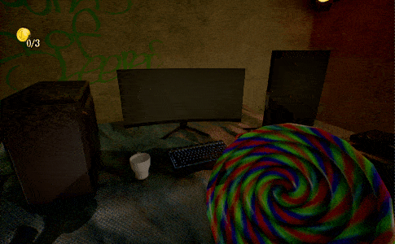

# Rage Room
```
Duration:   2024 February - 2024 April
Engine:     Unreal Engine 5
Genre:      Simulator
Team:       Solo Project
```
## A Brief Game Description
Welcome to Rage Room Simulator – where you unleash your inner fury in the most satisfying way possible by **smashing**!

## Info
This solo project was our intro to learning Unreal Engine. In this project I experimented with:
- Chaos Destruction
- Hit Tracing
- Animations
- ... and Unreal Engine's Blueprints

---

###  Melee Swing

#### Animations

You can perform two types of swings. Depending on the camera's pitch, one of two different swing animations will play. The animations were sourced from a website but were manually adjusted and fine-tuned in the engine to achieve the desired swing effect. Tweaking the animations was challenging, as adjusting a bone to fit the melee weapon would also alter other parts of the animation.

|Swing 1|Swing 2|
|---|---|
|||

#### Hit Tracing
I used a tracing plug-in called [MeleeTracing](https://www.unrealengine.com/marketplace/en-US/product/melee-trace) to notify hit events during animations. The weapon couldn't have a constantly active hitbox, as that would cause it to break objects simply by touching them. I wanted it to only interact with objects during the swing. The plug-in helped detect hits on the weapon specifically during swing animations, ensuring accurate collisions.


||
|---|

---

### Coin System
I implemented a coin system to drive progression in the game. To advance to the next level, players must collect all the coins in the current level. Each time an object is destroyed, there is a chance for a coin to spawn, adding an element of randomness and challenge to the gameplay

||
|---|

---

### Chaos Destruction
To break objects realistically, I used Unreal's Chaos Destruction system. For each breakable object, I created a Chaos Destruction class. This allowed me to control various aspects of the destruction, such as the number of pieces it would break into, the shapes of those pieces, the amount of force required to break it, the way it would fall apart, and whether certain sections should remain intact.

> *Note: not all objects were made into breakable Chaos Destruction Objects. Some objects, mainly heavier metal objects, just simulated physics without breaking apart. See the third GIF below.*

| |  |
|---|---|
| | |


